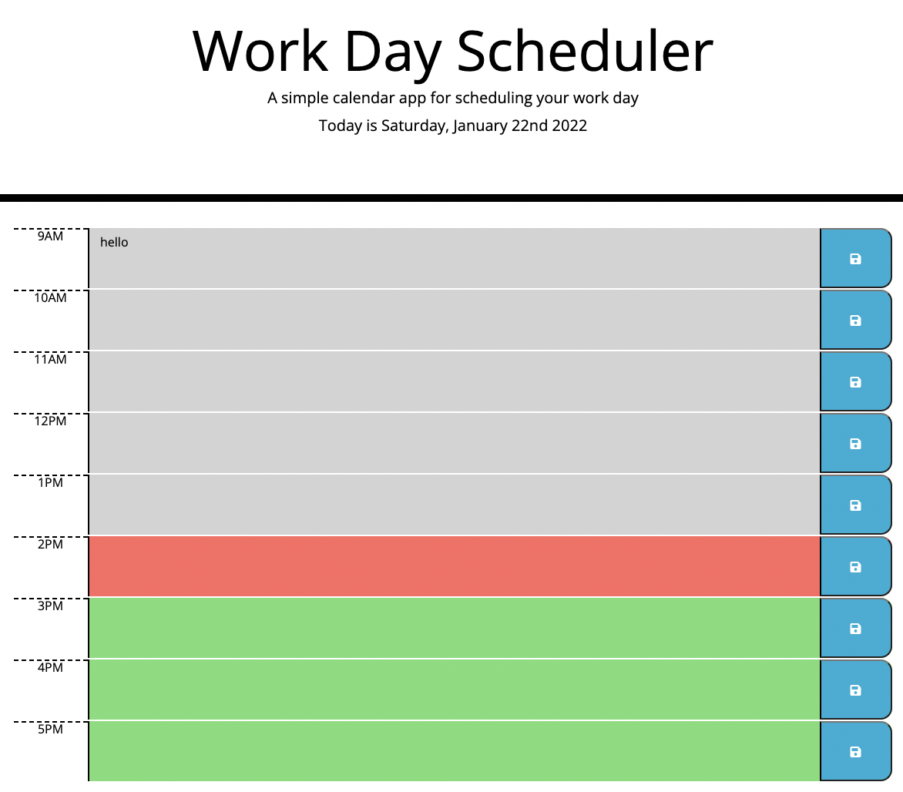

# Work Day Scheduler

## Project Description
5: Third-Party APIs Challenge: Work Day Scheduler

The app takes what is entered into each time block and saves it into localStorage. When app is loaded, it takes the information in localStorage and enters it into the corresponding time blocks.

## Features
- Displays current date at the top
- Updates the time block colors according to current system time for past, present and future
- Takes textarea inputs and saves them into localStorage

## Technologies used
- HTML
- CSS
- JavaScript
## Libraries used
- Moment.js
- jQuery